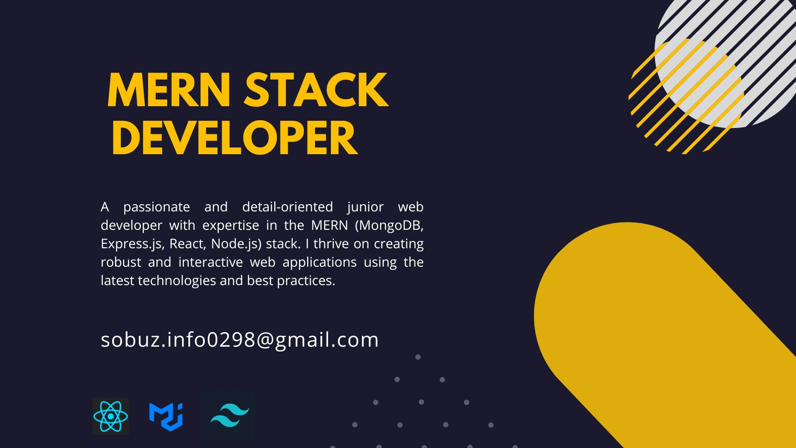

### Hi there 👋

### Current Stats

### Technology that i knows
- Expertise:  HTML || CSS3 ||  TALIWIND CSS ||  REACT JS || REST API || MATERIAL UI || DAISY UI || FIREBASE .
- Comfortable:  JAVASCRIPT || ES6 || EXPRESS JS || MONGODB || JWT.
- Familiar:  NODE JS || NEXT JS || REDUX || TYPESCRIPT || MONGOOSE.
- Tools: GITHUB || VS CODE || NPM || VERCEL || NETLIFY || VITE || GIT || STRIPE || CHATGPT || CHROME DEV TOOLS.

### Current Overview
- 🌱 I’m currently learning "concepts in Redux and exploring new features in MongoDB"
- 👯 I’m looking to collaborate on "Open source projects related to MEAN stack development."
- 🤔 I’m looking for help with "Optimizing performance in Express.js and handling complex queries in MongoDB."
- 💬 Ask me about REACT || JAVASCRIPT || ES6 || REACT ROUTER || NEXT JS || NODE JS || MONGODB 
- 📫 How to reach me: "Feel free to reach out to me via email at [sobuz.info0298@gmail.com] or connect with me on LinkedIn [https://www.linkedin.com/in/sobuz-mia/]."
- ⚡ Fun fact: "I enjoy Explore new libraries and frameworks in my free time."

